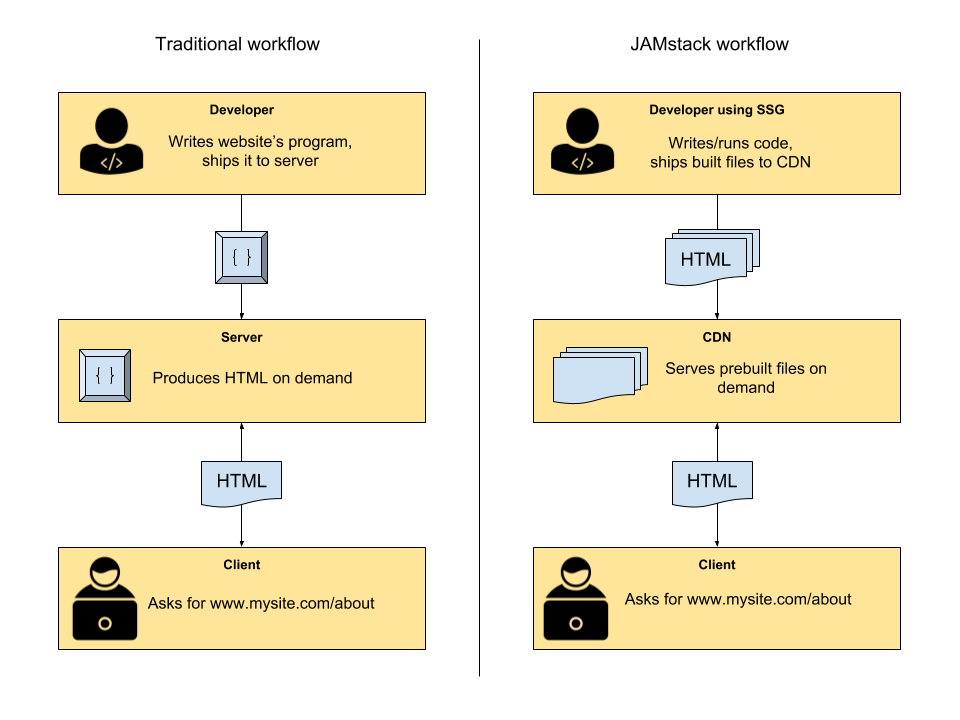

# JAMstack & Gatsby

## Make static sites great again!

Simon Hopstätter  
E.ON DD&T  
05 / 2019

---

## Late 1990s to early 2000s: Static Websites

---

## Since late 2000s: Dynamic Websites

---

## Wordpress

- Powering **33% of the web**
- Almost 50% of all sites are hosted on wordpress.com
- wordpress.com has 142M unique visits per month

- Resources: Webservers, FTPs, Databases
- Less than 1/3 are updated to the latest version
- Many sites are abandoned

---

## Meet JAMstack

---

## Dynamic Site vs. JAMstack workflow

---

## What is our static site?

- JavaScript: Basically React & NodeJS (Gatsby)
- APIs: Allowed but NOT treated as part of our site (e.g. Google Geolocation, Twitter API etc.)
  - GraphQL queries at build-time for content (Markdown, posts, images...)
- Markup: Generated HTML5

**Everything gets precompiled!**

---

## JAMstack in a nutshell

- work locally in a git repository
  - Write posts & pages in MD(X) 💖
- Push changes to remote repository
- (Automatically) build site using a static site generator (Gatsby)
- (Automatically) deploy to CDN hoster (Netlify)
- Site is live!

---

## Advantages

- Badass Performance
  - Everything is precompiled and handled client-side
  - CDNs are way faster than classic hosters
  - Gimmicks like gatsby-image
- developer-friendly workflow
  - We just work with git. And Markdown 💖
  - building & deployment are decoupled and automated
  - CDN takes care of cache invalidation