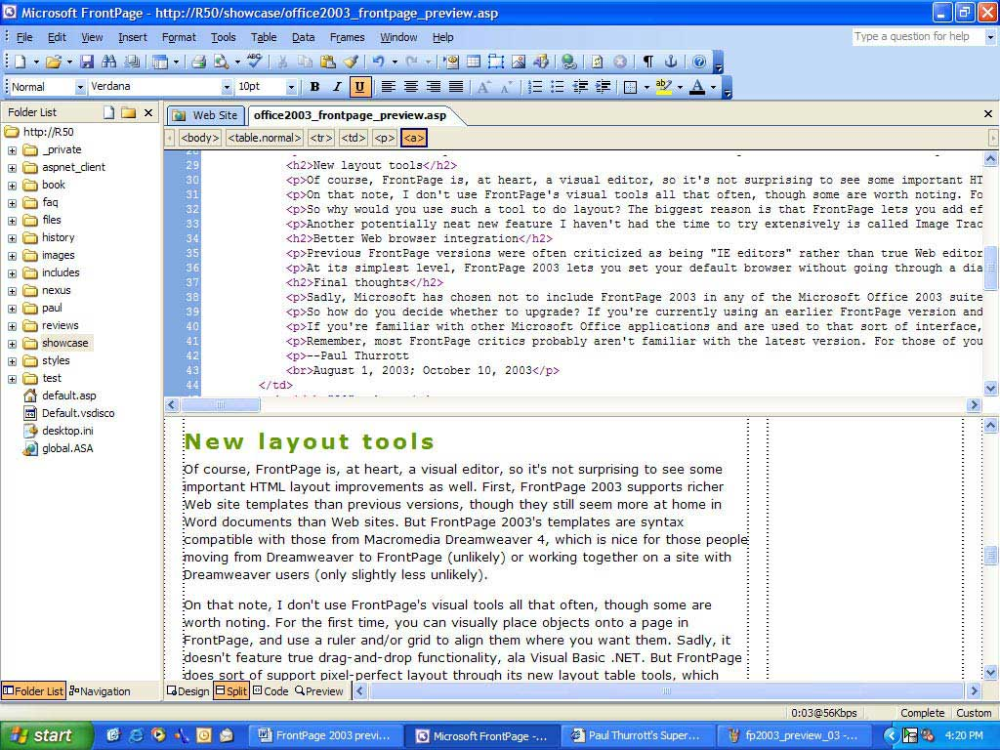
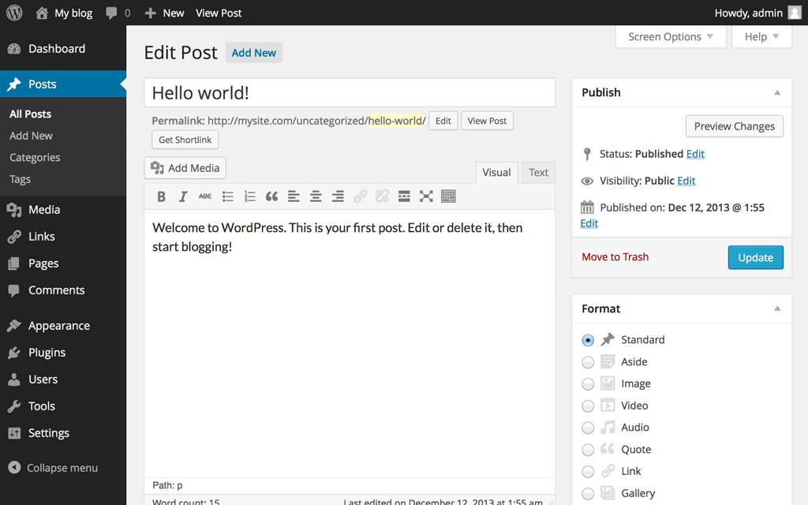
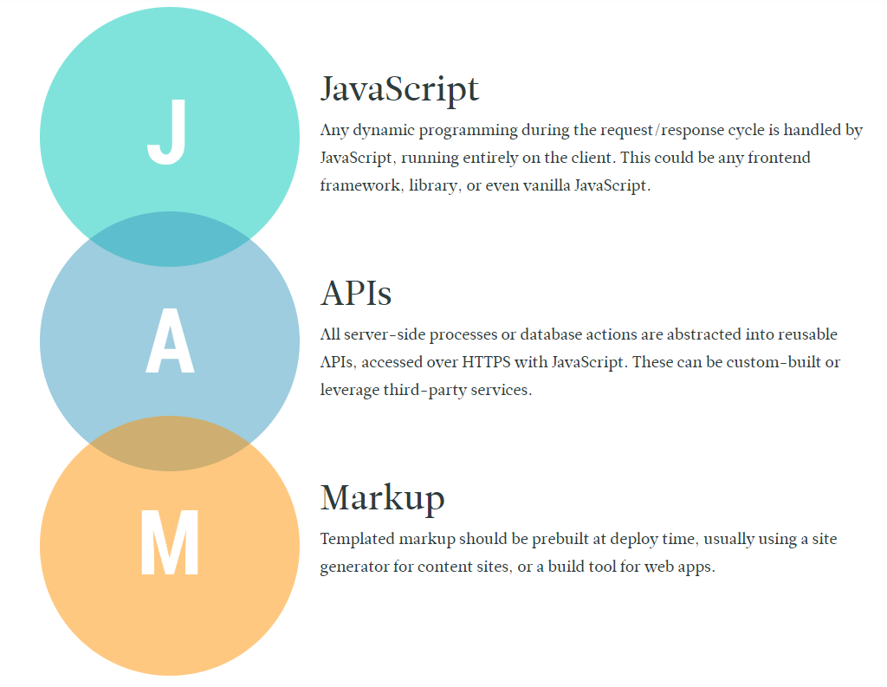
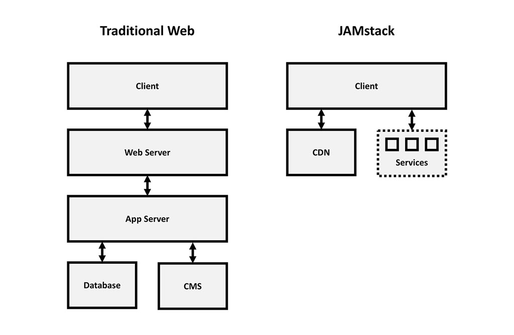
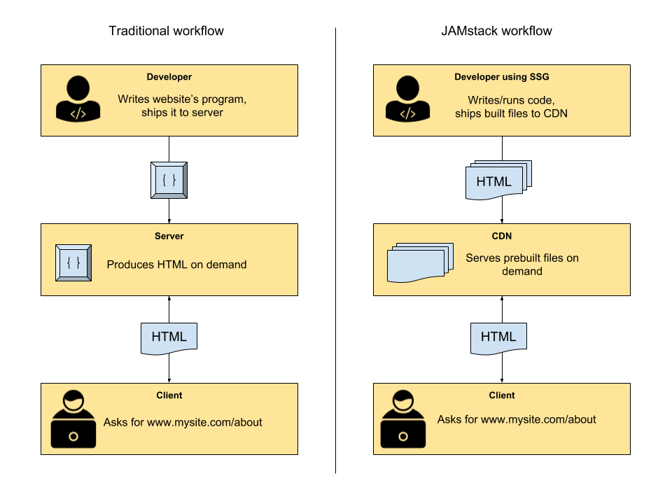
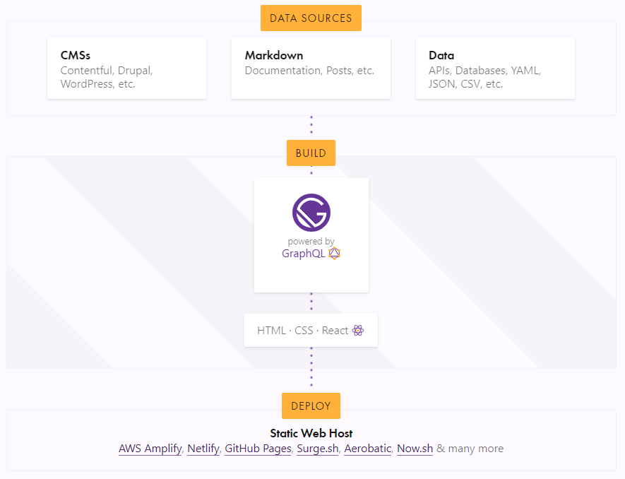

# JAMstack & Gatsby

## Make static sites great again!

Simon Hopstätter    
05 / 2019

---

## Late 1990s to early 2000s: Static Websites

---

## Since late 2000s: Dynamic Websites

---

## Wordpress

- Powering **33% of the web**
- Almost 50% of these sites are hosted on wordpress.com
- wordpress.com has 142M unique visits per month

- Resources: Webservers, FTPs, Databases
- Less than 1/3 are updated to the latest version
- Many sites are abandoned

---

## Meet JAMstack

---

## Architecture

---

## Workflow

---

## What is our static site?

- JavaScript: Basically React & NodeJS (Gatsby)
- APIs: Allowed but NOT treated as part of our site (e.g. Google Geolocation, Twitter API etc.)
  - GraphQL queries at build-time for content (Markdown, posts, images...)
- Markup: Generated HTML5

**Everything gets precompiled!**

---

## JAMstack & Gatsby in a nutshell

- Write posts & pages - in React/HTML or MDX 💖
- Push changes to remote git repository
- Everything else can be automated
  - Build site using a static site generator (Gatsby)
  - Deploy to CDN hoster (Netlify)
- Site is live!

---

## The Great Gatsby

---

## Code!

---

## Advantages

- Performance
  - Everything is precompiled and handled client-side
  - CDNs serve pages faster than dynamic webservers
- Security
  - No database or webserver required
  - Literally nothing to attack
- Developer-friendly
  - Just work with git
  - Building & deployment are decoupled & automated
  - CDN takes care of cache invalidation
  - External authoring with headless CMS is possible

---

## Disadvantages

- Every change requires a new build
- Not suited for every web application
  - complex SPAs
  - Sites relying heavily on access control

---

## That's it

:no_upscale()/cdn.vox-cdn.com/uploads/chorus_image/image/55278743/gatsby.1497548146.gif)

Any questions or remarks?